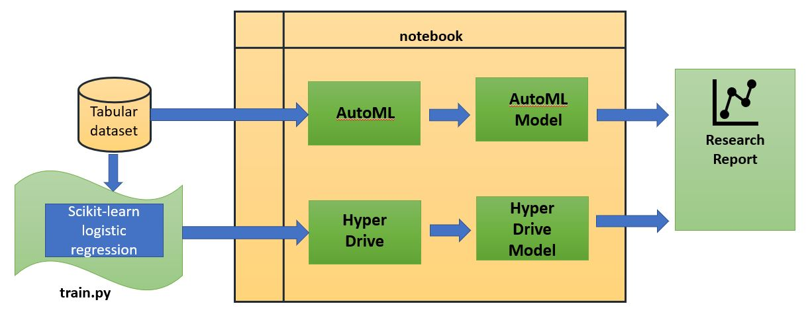
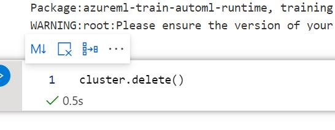
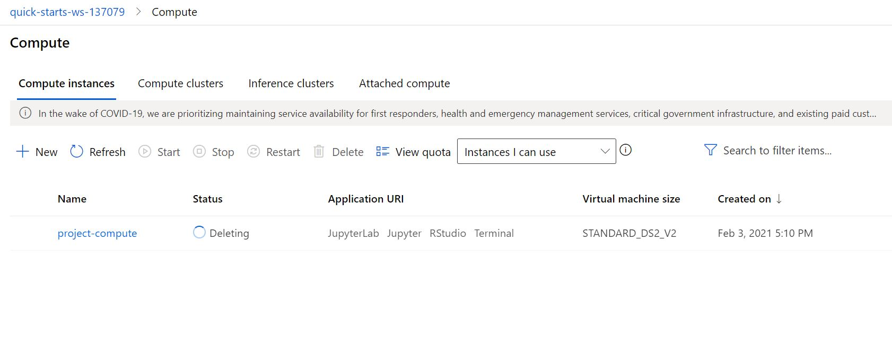

# Optimizing an ML Pipeline in Azure

## Overview
This project is part of the Udacity Azure ML Nanodegree.
In this project, we build and optimize an Azure ML pipeline using the Python SDK and a provided Scikit-learn model.
This model is then compared to an Azure AutoML run.

## Project Workflow
The overall workflow/architecture of the project for creating and optimizing the ML pipeline is shown below:

## Summary
The dataset contains data about a bank marketing campaign. It contains 21 features related to 322951 potential customers. We need to to predict whether a given client would subscribe to a term deposit or not. The dataset contained information about the last call that was made to the prospective client about the current campaign and the information about the client's credit history and demographic data.

The best performing model was the one produced by the AutoML run. AutoML model's accuracy was 91.59% which was better than the Logistic Regression model with the accuracy of 91.09%.

## Scikit-learn Pipeline
We first performed the data cleaning activity. The feature engineering tasks were performed where we encoded categorical features of the dataset, month and day of the week variables were converted from strings to int. 

Logistic Regression is chosen as prediction model.

The parameter sampler helps to find the optimal hyperparameters by randomly sampling combinations of them. 
The regularization hyperparameter (C) is set to ensure that our model does not overfit the data by penalizing addition of features. 
The max_iter (maximum iteration) hyperparameter controls the number of iterations to be done before we select our final model.

Additionally, we split the data into train and test datasets. We use 80:20 ratio for train and test respectively.

The bandit termination policy helps to stop the iteration early when the primary metric being evaluated is outside the slack factor threshold. It helps to converge to the best model faster.

## AutoML
In the AutoML pipeline, we first created the tabular dataset with the training data. The data preparation and feature engineering steps are same as scikit learn pipeline.
We can evaluate different models in AutoML. AutoML generated 31 iterations; the best model (VotingEnsemble) comes up with 0.9159 of accuracy with the following hyperparameters selected:

min_samples_split=0.01,
min_weight_fraction_leaf=0.0,
n_estimators=25,
n_jobs=1,
oob_score=True,
random_state=None,
verbose=0,
warm_start=False

## Pipeline comparison
While comparing the two models we can see that AutoML has better performance in accuracy (91.59%) as compared to Logistic Regression (91.09%).
In terms of architecture, AutoML architecture is quite straight forward and user friendly. AutoML ran for 27 options of models and can scale the features of the dataset and cross-validation to prevent bias.

## Future work
We can do statistical analysis first on the data to finalize the features actually significant for the prediction. 
We can check the data imbalance problem in the dataset and can address it with SMOTE library (upsampling or downsampling) or with class_weight hyperparameter of logistic regression. Currently there is data imbalance in the data as the size of the smallest class is 2961 out of 26360 in training data.
We can also try some other hyperparameters such as penalty, solver etc, l1_ration of logistic regression.

## Proof of cluster clean up

cluster.delete() command was used for deleting the cluster:

